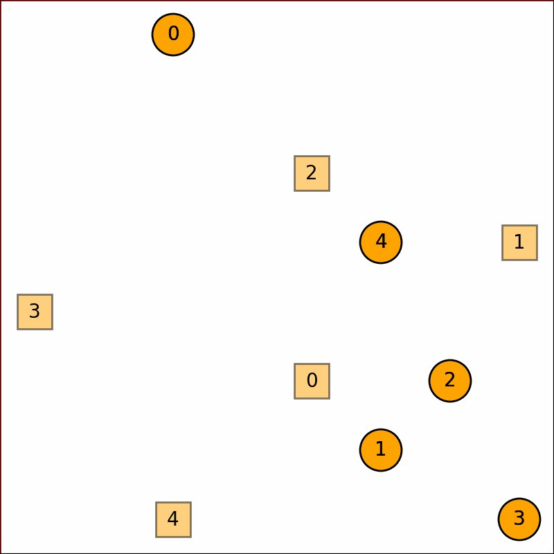
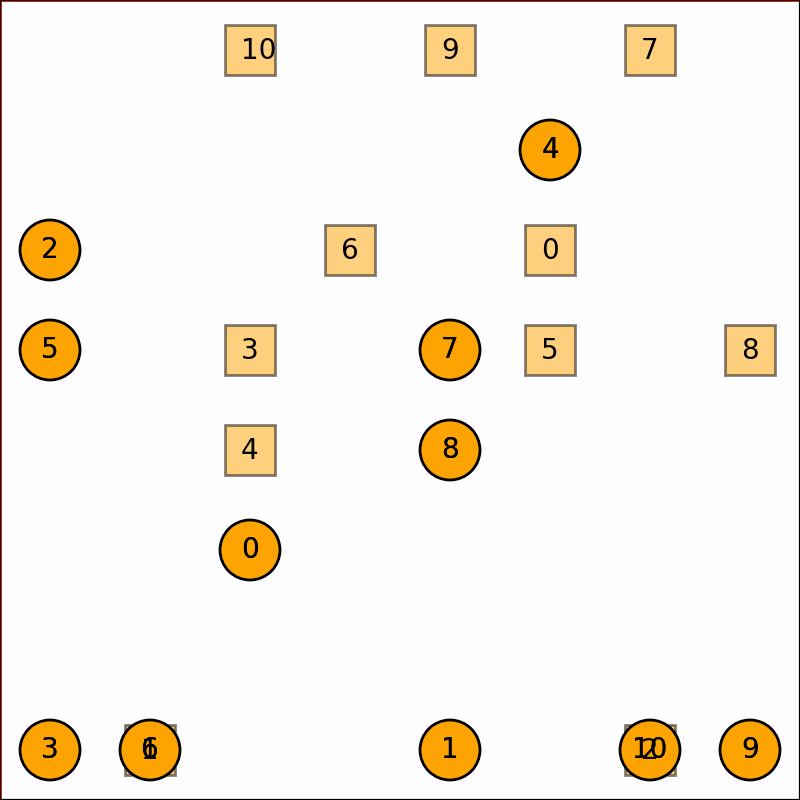

# CBS
5个智能体(机器人)



11个智能体(机器人)



## 模块说明


cbs.py：对于mission/input中的yaml文件进行多智能体的路径规划，可直接运行命令
```
python cbs.py
```
对mission/input中的规划任务进行处理，处理结果存入mission.output中，输入输出一一对应，如果不存在输出，则说明路径规划失败（超时或无解）

a_star.py：CBS算法中低层的A*算法

viusalize.py：对input.yaml和output.yaml文件处理成sample.git文件,input和output要一一对应。可运行命令
```
python visualize.py {input} {output} {visualizeFile}
```
例如
```
python visualize.py mission/input/5/input1.yaml mission/input/5/input1.yaml sample.gif
```

evaluation.py：在运行该cbs.py得到输出的output.yaml文件后进行实验评估，输出time.png和succ.png两张图以及具体信息。

mission/randomCreateMission.py：随机生成input.yaml文件作为路径规划的任务


## 实验
### 创建多路径规划任务
```
cd mission
python randomCreateMission.py
```
### 运行cbs算法
```
python cbs.py
```
### 评估实验结果
```
python evaluation.py
```
### 可视化
```
python visualize.py mission/input/5/input1.yaml mission/input/5/input1.yaml sample.gif
```

